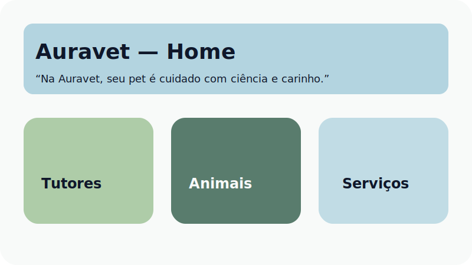
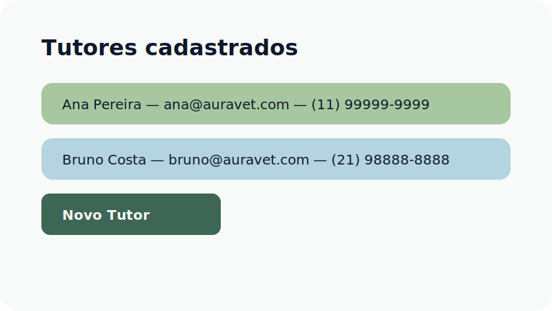
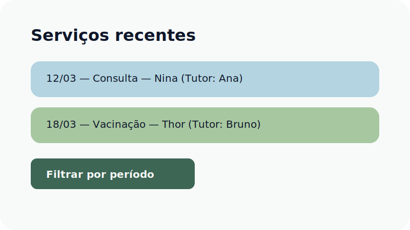

# Auravet — Cuidar é natural.

Auravet é uma clínica veterinária digital-first que une ciência e acolhimento. Este monorepo entrega frontend React com Tailwind e backend Node + Express + Prisma, totalmente integrado com PostgreSQL, validação Zod e documentação Swagger.

## ✨ Identidade Auravet
- **Paleta:** savia `#A7C7A0`, azul `#B3D4E0`, verde escuro `#3D6655`, gelo `#F8FAF9`, grafite `#0F172A`.
- **Tipografia:** Montserrat (títulos) e Nunito Sans (texto).
- **Tom:** empático, didático, sustentável.

## 🏗️ Estrutura do monorepo
```
auravet/
├─ apps/
│  ├─ api/        # Node 20 + Express + Prisma + Swagger
│  └─ web/        # React 18 + Vite + TailwindCSS (tema Auravet)
├─ docs/          # Visual previews
├─ infra/docker/  # Docker Compose stack
├─ .env.example
├─ package.json   # Workspaces (api + web)
└─ README.md
```

## 🚀 Primeiros passos

### 1. Pré-requisitos
- Node.js 20+
- npm 9+
- PostgreSQL 16 (opcional se usar Docker)

### 2. Configuração de ambiente
```bash
cp .env.example .env
```
Ajuste `DATABASE_URL`, `API_PORT`, `CORS_ORIGIN`, `JWT_SECRET`, `JWT_EXPIRES_IN`, `PASSWORD_SALT_ROUNDS`, `AUTH_RATE_LIMIT_WINDOW_MS`,
`AUTH_RATE_LIMIT_MAX` e `VITE_API_URL` conforme o cenário. As variáveis `SEED_ADMIN_EMAIL`, `SEED_ADMIN_PASSWORD` e
`SEED_ADMIN_NAME` são opcionais para o seed inicial.

> `PASSWORD_SALT_ROUNDS` controla o custo exponencial (`2^N`) utilizado pelo Scrypt durante o hashing das senhas.

### 3. Instalar dependências
```bash
npm install
```

### 4. Preparar banco de dados
```bash
npm run prisma:generate --workspace apps/api
npm run prisma:migrate --workspace apps/api
npm run prisma:seed --workspace apps/api
```

### 5. Executar em modo desenvolvimento
```bash
npm run dev
```
- API disponível em `http://localhost:4000`
- Swagger em `http://localhost:4000/docs`
- Frontend em `http://localhost:5173`

### 6. Scripts úteis
- `npm run lint` — ESLint em ambos os apps.
- `npm run typecheck` — TypeScript estrito.
- `npm run format` — Prettier (modo check).
- `npm run build` — build completo (api + web).
- `npm run test --workspace apps/api` — testes de autenticação e autorização com Node Test Runner + Fetch nativo.

## 🐳 Stack com Docker
```bash
cd infra/docker
cp ../../.env.example ../../.env  # se ainda não existir
docker compose up --build
```
Serviços provisionados:
- **db**: PostgreSQL 16 (healthcheck incluso).
- **api**: Express + Prisma rodando em `http://localhost:4000`.
- **web**: Vite build servido por Nginx em `http://localhost:5173`.

## 🔌 API REST
Principais endpoints (todas as rotas, exceto `/health` e `/auth/login`, exigem Bearer token JWT):
- `GET /health`
- `POST /auth/login` — autenticação de colaboradores (rate limit configurado).
- `POST /auth/register` — criação de usuários internos (apenas Administrador).
- `GET /auth/me` — retorna usuário autenticado e permissões.
- CRUD de tutores (`/owners`), com controle de permissões `owners:read`/`owners:write`.
- CRUD de animais + histórico (`/animals`), respeitando permissões `animals:*` e `services:read`.
- Serviços com filtros (`/services`), com permissão `services:read`/`services:write`.
- Gestão de usuários internos (`/users`, `/users/{id}`, `/users/{id}/status`).
- Swagger: `GET /docs`

Todas as requisições passam por validação Zod (422 em caso de erro) e retornam `{ error, details? }` para mensagens amigáveis. Tokens
JWT são assinados com `JWT_SECRET` e expiram conforme `JWT_EXPIRES_IN`.

## 🖥️ Frontend React
- React Router com páginas: Login, Home, Tutores, Animais, Serviços, Registrar Serviço, Gestão de Usuários (somente Admin) e
  tela de acesso não autorizado.
- `AuthProvider` centraliza o token JWT, consulta `GET /auth/me` via React Query e aplica guards (`ProtectedRoute` +
  `RequirePermissions`).
- Cabeçalho exibe o colaborador autenticado, papel e botão de sair; navegação é filtrada por permissão em tempo real.
- Componentes de design (Logo, Header, Card, Field, Button, Modal, Select) com Tailwind e fontes Montserrat/Nunito.
- React Query + Fetch wrapper (`apiClient`) com interceptação 401 → logout automático e `VITE_API_URL`.
- Formulários com React Hook Form, toasts com Sonner e modais HeadlessUI.

Fluxo mínimo testável:
1. Acesse `/login` com o administrador seed (`admin@auravet.com` / senha configurada em `SEED_ADMIN_PASSWORD`).
2. Cadastre um tutor em **Tutores**.
3. Cadastre um pet em **Animais** vinculado ao tutor.
4. Registre serviços em **Registrar serviço** (visível para papéis com `services:write`).
5. Como administrador, gerencie colaboradores em **Usuários** (criação, mudança de papel e ativação/desativação).

## 📸 Previews
| Tela | Visual |
| ---- | ------ |
| Home |  |
| Tutores |  |
| Serviços |  |

## 🔍 Qualidade e automações
- **TypeScript estrito** nos dois apps.
- **ESLint + Prettier** configurados por workspace.
- **Husky** roda `lint` + `typecheck` em todo commit.
- **Prisma** com relacionamentos Owner → Animal → Serviço e enumerações oficiais da clínica.
- **Node.js Test Runner** cobre login, registro e bloqueios de permissão do backend usando fetch nativo e Prisma em memória.

## 💚 Filosofia de produto
> “Na Auravet, seu pet é cuidado com ciência e carinho.”

Toda a copy e experiência seguem essa premissa, entregando uma plataforma acolhedora, sustentável e didática para a equipe da clínica.
